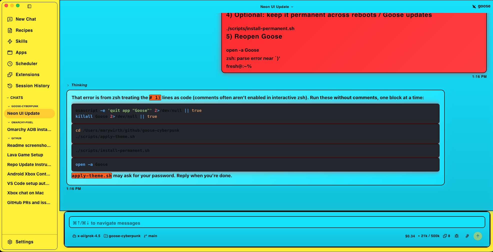

# goose-cyberpunk

**Inverted neon cyberpunk** theme for the [Goose](https://github.com/block/goose) desktop app.

Bright popping neon surfaces with **bold black text** — the classic dark void theme flipped inside-out.

| Zone | Neon |
|------|------|
| Left sidebar | **orange** `#ff6b00` |
| Chat area | **yellow** `#fff200` |
| Input box | **blue** `#00e5ff` |
| User bubbles | **red** `#ff2a2a` |
| AI bubbles | **cyan-blue** `#7df9ff` |
| All text | **bold black** `#0a0a0a` |

Orbitron / Rajdhani / Share Tech Mono fonts, larger type, hard black outlines, and neon glows.

Works on **Linux** and **macOS**. Patches Goose’s packaged Electron `app.asar` (with automatic stock backup). On macOS, the installer also refreshes Electron’s ASAR-integrity metadata and re-signs the app locally; this is required by current Goose releases.

> Goose does not ship a public theme API, so this rewrites UI tokens + injects CSS inside the app bundle. Re-apply after Goose updates (or install the permanent helper).

---

## Preview of the scheme

| Element | Color |
|---------|-------|
| Chat / app background | `#fff200` neon yellow |
| Left sidebar | `#ff6b00` neon orange |
| Input box | `#00e5ff` neon blue |
| Typed + UI text | `#0a0a0a` bold black |
| Your messages | `#ff2a2a` neon red |
| Goose replies | `#7df9ff` neon blue |
| Code / terminal panel | `#ff3355` neon red-pink |

Full token table: [`docs/color-scheme.md`](docs/color-scheme.md)

---

## Requirements

- Goose desktop installed
- [Node.js](https://nodejs.org/) 18+ (`npx` used to pack/unpack asar)
- `python3`
- Write access to Goose’s `app.asar` (sudo / admin password once)
- On macOS, permission for the terminal app to manage applications (**System Settings → Privacy & Security → App Management**) if Goose is installed in `/Applications`

---

## Quick start

```bash
git clone https://github.com/fresh3nough/goose-cyberpunk.git
cd goose-cyberpunk
./scripts/apply-theme.sh
```

Fully quit Goose (not just close the window), then reopen it.

### macOS

```bash
git clone https://github.com/fresh3nough/goose-cyberpunk.git
cd goose-cyberpunk
./scripts/apply-theme.sh
# If Goose lives outside /Applications:
# GOOSE_ASAR="$HOME/Applications/Goose.app/Contents/Resources/app.asar" ./scripts/apply-theme.sh
```

You may be prompted for your password to write into `/Applications/Goose.app/...`.

### Linux

```bash
./scripts/apply-theme.sh
# Default path: /usr/lib/goose/resources/app.asar
# Override: GOOSE_ASAR=/path/to/app.asar ./scripts/apply-theme.sh
```

---

## Make it permanent (survives reboot + Goose updates)

```bash
./scripts/install-permanent.sh
```

| OS | What it installs |
|----|------------------|
| **Linux** | systemd user service + path watcher on `app.asar` + XDG autostart entry |
| **macOS** | LaunchAgent at login + hourly refresh |

Undo permanence (theme files stay; auto re-apply stops):

```bash
./scripts/uninstall-permanent.sh
```

---

## Restore stock Goose UI

```bash
./scripts/restore-theme.sh
```

Stock backup is saved on first apply to:

```text
~/.local/share/goose-cyberpunk/backups/app.asar.stock
```

---

## What the patch does

1. Locates Goose `app.asar` (Linux/macOS common paths, or `GOOSE_ASAR`)
2. Backs up the stock asar
3. Extracts the archive
4. Copies [`theme/cyberpunk-neon.css`](theme/cyberpunk-neon.css) into the renderer assets
5. Patches `index.html` to force the themed class and load the CSS
6. Rewrites light/dark CSS variable token maps in the JS bundles to inverted neon colors
7. Tweaks user/agent message bubble styles when the stock strings are present
8. Repacks and installs the asar
9. Writes Goose `settings.json` with `theme: dark` and `useSystemTheme: false` (CSS still hooks `.dark`)

### Settings paths

| OS | File |
|----|------|
| Linux | `~/.config/Goose/settings.json` |
| macOS | `~/Library/Application Support/Goose/settings.json` |

---

## Repository layout

```text
goose-cyberpunk/
├── README.md
├── theme/
│   ├── cyberpunk-neon.css   # main stylesheet (inverted neon)
│   └── theme.json           # metadata + palette
├── scripts/
│   ├── apply-theme.sh       # cross-platform patcher
│   ├── restore-theme.sh
│   ├── install-permanent.sh
│   └── uninstall-permanent.sh
├── systemd/                 # Linux unit templates
├── launchd/                 # macOS LaunchAgent template
├── autostart/               # .desktop template
└── docs/
    └── color-scheme.md
```

---

## Troubleshooting

**Goose crashes immediately after applying the theme (macOS)**
Update this repository and run `./scripts/apply-theme.sh` again. Current Goose builds enforce Electron ASAR integrity; the script now recalculates that header hash and re-signs the modified local app. If macOS says `Operation not permitted`, enable App Management for your terminal app in System Settings, then re-run the script.

**Theme didn’t change**  
Fully quit Goose (check system tray / menu bar) and reopen. Electron caches the old asar until process exit.

**`asar` / pack errors**  
Install Node 18+ so `npx asar` works.

**Permission denied writing `app.asar`**  
Run the apply script again and approve sudo/admin. On macOS, grant Terminal/IDE Full Disk Access if Gatekeeper blocks writes under `/Applications`.

**Goose updated and theme vanished**  
Run `./scripts/apply-theme.sh` again, or use `./scripts/install-permanent.sh` so it auto-heals.

**Custom install location**

```bash
export GOOSE_ASAR="/path/to/app.asar"
./scripts/apply-theme.sh
```

---

## Uninstall completely

```bash
./scripts/uninstall-permanent.sh
./scripts/restore-theme.sh
rm -rf ~/.local/share/goose-cyberpunk ~/.local/state/goose-cyberpunk
```

---

## Notes / disclaimer

- This is an **unofficial** fan theme. It modifies Goose’s application bundle locally.
- After official Goose upgrades, hashes change — re-apply (or rely on the permanent installer).
- CSS targets Goose’s design tokens (`--color-background-primary`, message bubbles, prose/code). Future Goose releases may rename classes; open an issue if a version breaks.

## License

Apache-2.0 (same family as Goose). Theme CSS and scripts are free to use and adapt.
